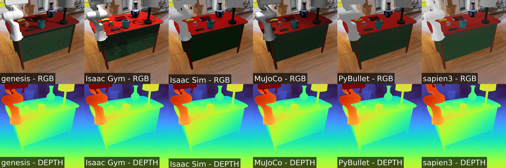

# 15. Gaussian Splatting-Based Scene Background Blending

In this tutorial, we demonstrate how to use 3D Gaussian Splatting (3D GS) scene assets generated by [EmbodiedGen](https://github.com/HorizonRobotics/EmbodiedGen) within MetaSim, along with photo-realistic 3d gs rendering powered by [RoboSplatter](https://github.com/HorizonRobotics/RoboSplatter). This integration enables diverse and realistic backgrounds in RoboVerse’s robotic simulation environments, overcoming the limitations of the existing fixed background library and enhancing the generalization of robot policies across multiple scenarios.


## Install 
```bash
pip install -e .[robosplatter]
```

## Common Usage
```bash
python get_started/15_gs_background.py  --sim <simulator>
```

In headless mode:
```bash
python3 get_started/15_gs_background.py --sim pybullet --headless
python3 get_started/15_gs_background.py --sim sapien3 --headless
python3 get_started/15_gs_background.py --sim genesis --headless
MUJOCO_GL=egl python3 get_started/15_gs_background.py --sim mujoco --headless
python3 get_started/15_gs_background.py --sim isaacgym --headless
python3 get_started/15_gs_background.py --sim isaacsim --headless
```

You will get the following image:
---



